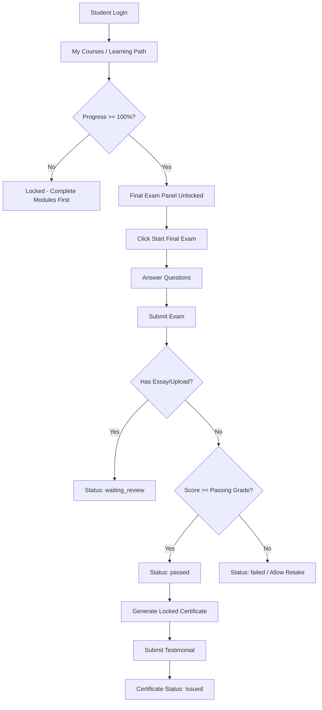

# TASK-005 — Multi-Section Final Exam and Certificate Scores

## Status

`AUDITING`

Status yang tersedia:
- `DISCUSSION`
- `AUDITING`
- `READY`
- `IN_PROGRESS`
- `TESTING`
- `COMPLETED`
- `BLOCKED`
- `CANCELLED`

---

## User Request

User ingin mengubah Final Exam pada course dari yang saat ini hanya 1 exam per course menjadi **Multi-Section Final Exam** (beberapa bagian/section yang dapat dikonfigurasi dinamis per course oleh Admin).

Contoh skenario:
- **Course TOEFL**:
  1. Listening Comprehension
  2. Structure and Written Expression
  3. Reading Comprehension
- **Course Kids**:
  1. Speaking & Listening
  2. Vocabulary & Grammar

Setiap section memiliki:
- Nama section (`title`);
- Urutan (`sort_order`);
- Kumpulan soal (`questions`);
- Attempt student (`attempts`);
- Nilai student (`total_score`);
- Status pengerjaan & kelulusan (`status`, `passing_grade`).

Nilai per section serta Final Score gabungan nantinya direncanakan untuk ditampilkan pada Sertifikat (Certificate).

---

## Objective

1. Melakukan audit komprehensif (read-only) terhadap seluruh flow Final Exam, Scoring, Progress/Completion, dan Certificate yang ada di codebase saat ini.
2. Mengidentifikasi root cause mengapa Final Exam saat ini terbatas 1 exam per course dan mengapa nilai exam belum masuk ke sertifikat.
3. Menyusun rancangan data model, backward compatibility, formula scoring, passing rule, retry rule, dan strategi snapshot nilai sertifikat.
4. Menyediakan rekomendasi teknis bertahap (phased implementation plan) dan testing checklist tanpa mengubah source code aplikasi, migration, database, atau status task pada tahap audit ini.

---

## Current Behavior

1. **Relasi CourseLevel ke FinalExam**:
   - Model `CourseLevel` memiliki method `finalExams()` dengan tipe `HasMany`.
   - Namun di `Admin\FinalExamController@index`, `create`, dan `store`, controller membatasi secara hardcode:
     ```php
     if ($courseLevel->finalExams()->exists()) {
         return redirect()->with('info', 'This course level already has a final exam.');
     }
     ```
   - Di `Student\LearningController@show`, sistem hanya mengambil exam pertama:
     ```php
     $finalExam = $courseLevel->finalExams?->first();
     ```
2. **UI & UX Admin**:
   - Admin hanya dapat membuat 1 Final Exam per course level.
   - Halaman detail Final Exam admin (`final-exams.index`) berasumsi hanya ada 1 exam tunggal.
3. **UI & UX Student**:
   - Student Learning Path hanya menampilkan 1 panel Final Exam di bagian bawah modul.
   - Student langsung mengerjakan 1 exam tunggal tersebut secara sekaligus.
4. **Certificate**:
   - Tabel `certificates` memiliki kolom FK `final_exam_attempt_id` yang hanya merujuk pada 1 ID attempt.
   - View PDF sertifikat (`pdf.certificate.blade.php`) **sama sekali belum menampilkan nilai (score/grade)**, hanya menampilkan Nama Student, Nama Course, Nomor Sertifikat, Tanggal Terbit, TTD, dan QR Code.

---

## Expected Behavior

1. **Multi-Section Admin Management**:
   - Admin dapat menambah, mengubah, mengurutkan (`sort_order`), dan menghapus banyak section Final Exam untuk satu Course Level.
   - Nama section dan jumlah section sepenuhnya bersifat dinamis (tidak di-hardcode berdasarkan nama/tipe course).
   - Admin dapat mengelola pertanyaan (`questions`), passing grade, dan max attempts khusus untuk masing-masing section.
2. **Multi-Section Student Exam Flow**:
   - Student dapat melihat daftar seluruh section Final Exam pada Course Level yang diambil.
   - Student mengerjakan exam per section secara terpisah.
   - Setiap section memiliki attempt history, status pengerjaan (`not_started`, `in_progress`, `submitted`, `waiting_review`, `passed`, `failed`), dan score tersendiri.
3. **Completion & Scoring**:
   - Sistem menghitung score masing-masing section dan mengelolanya secara terpisah.
   - Sistem menghitung Final Score gabungan berdasarkan formula yang disepakati (misal: Average Equal Weight).
   - Kelulusan course dan syarat penerbitan sertifikat ditentukan setelah seluruh section wajib selesai & memenuhi kriteria lulus.
4. **Certificate Scores**:
   - Certificate mampu menyimpan snapshot nilai rincian per section dan Final Score saat sertifikat diterbitkan (`locked` / `issued`).
   - Layout PDF sertifikat / transkrip menampilkan rincian nilai section student dengan rapi.

---

## Audit Findings

### 1. Structure Course Existing
- **Model Utama**: `CourseLevel` (di bawah `CourseProgram`).
- **Entity Terkait**: `CourseLevel`, `Module`, `StudentCourseEnrollment`, `FinalExam`, `FinalExamQuestion`, `FinalExamAttempt`, `Certificate`.
- **Relasi Actual**:
  - `CourseLevel` -> `finalExams()` : `HasMany` (pada file [CourseLevel.php](file:///d:/Kerja%20File/Freelance/E-Course%20Queens/Coding/Real/queens-english-prestige/app/Models/CourseLevel.php#L60-L63)).
  - `FinalExam` -> `courseLevel()` : `BelongsTo` (pada file [FinalExam.php](file:///d:/Kerja%20File/Freelance/E-Course%20Queens/Coding/Real/queens-english-prestige/app/Models/FinalExam.php#L27-L30)).
- **Tempat Pembatasan Single Exam**:
  - Database schema (`final_exams` table) **TIDAK MEMILIKI UNIQUE CONSTRAINT** pada `course_level_id`. Database sudah mampu menampung banyak record `final_exams` per `course_level_id`.
  - Pembatasan murni dilakukan di **Controller & View Application Level**:
    - [Admin/FinalExamController.php](file:///d:/Kerja%20File/Freelance/E-Course%20Queens/Coding/Real/queens-english-prestige/app/Http/Controllers/Admin/CourseManagement/FinalExamController.php#L16-L45): mengabaikan record tambahan dengan `->first()` dan menolak pembuatan exam baru jika `finalExams()->exists()`.
    - [Student/LearningController.php](file:///d:/Kerja%20File/Freelance/E-Course%20Queens/Coding/Real/queens-english-prestige/app/Http/Controllers/Student/LearningController.php#L51): `$finalExam = $courseLevel->finalExams?->first();`.
    - [learning-path/final-exam.blade.php](file:///d:/Kerja%20File/Freelance/E-Course%20Queens/Coding/Real/queens-english-prestige/resources/views/partials/student/learning-path/final-exam.blade.php): menerima 1 `$finalExam` tunggal.

### 2. Database Final Exam Findings
- **Nama Tabel**: `final_exams`.
- **Struktur Kolom**:
  - `id` (bigint, PK)
  - `course_level_id` (bigint, FK to `course_levels.id`)
  - `title` (string)
  - `description` (text, nullable)
  - `passing_grade` (integer, default 0)
  - `grading_method` (enum: 'auto', 'manual', 'mixed')
  - `max_attempts` (integer, nullable)
  - `is_active` (boolean, default true)
  - `created_at`, `updated_at`
- **Catatan Kolom Missing**: `sort_order` belum ada pada tabel `final_exams`.
- **Empirical Local DB Audit**:
  - Total `final_exams` saat ini: **2 record**.
  - Total `course_levels` yang memiliki final exam: **2 course**.
  - Total course dengan >1 exam: **0 course**.
  - Orphan record: **0 record**.
  - Total questions: **5 questions** (2 multiple_choice, 2 upload, 1 short_answer).
  - Total attempts: **7 attempts** (tersebar di status passed, failed, waiting_review).
  - Total certificates: **3 certificates**.

### 3. Admin Final Exam Management Audit
- Admin routes:
  - List/Index: `GET /admin/course-management/levels/{courseLevel}/final-exam` (`Admin\FinalExamController@index`)
  - Create: `GET /admin/course-management/levels/{courseLevel}/final-exam/create` (`create`)
  - Store: `POST /admin/course-management/levels/{courseLevel}/final-exam` (`store`)
  - Edit: `GET /admin/course-management/final-exams/{finalExam}/edit` (`edit`)
  - Manage Questions: `GET /admin/course-management/final-exams/{finalExam}/questions` (`Admin\FinalExamQuestionController@index`)
- Seluruh tombol dan route perbaikan soal (`final-exams/{finalExam}/questions`) **sudah menggunakan `{finalExam}` ID**, bukan `courseLevel` ID. Ini sangat memudahkan karena soal sudah terikat ke record `final_exams` spesifik!

### 4. Student Final Exam Flow Audit
- Exam dibuka jika `progress_percentage >= 100` pada enrollment ([FinalExamController.php](file:///d:/Kerja%20File/Freelance/E-Course%20Queens/Coding/Real/queens-english-prestige/app/Http/Controllers/Student/FinalExamController.php#L304)).
- Pengerjaan & submit menggunakan route `student.final-exam.submit` yang mengikat ke `FinalExam $finalExam`.
- Attempt disimpan ke `final_exam_attempts` (`student_id`, `final_exam_id`, `attempt_number`, `total_score`, `status`, `started_at`, `submitted_at`, `graded_at`).
- Jika lulus (`status === 'passed'`), dipanggil `CertificateService::createLockedCertificateFromAttempt($attempt)` yang otomatis mengubah status enrollment menjadi `completed`.

### 5. Existing Score Calculation & Certificate Audit
- Calculation Formula per Exam:
  $$\text{percentageScore} = \text{round}\left(\left(\frac{\text{earnedScore}}{\text{maxScore}}\right) \times 100, 2\right)$$
- Nilai disimpan sebagai `decimal(5,2)` persentase (0-100).
- Certificate saat ini **tidak menyimpan score** dan **tidak menampilkan score** di Blade/PDF. `certificates` hanya menyimpan FK `final_exam_attempt_id`.

---

## Final Exam Multi-Section Concept

Dengan konsep **Multi-Section Final Exam**:
```
CourseLevel (TOEFL)
  ├── FinalExam Section 1 (Listening Comprehension)
  │     ├── Questions (50 soal)
  │     └── Attempts (Attempt #1, Attempt #2)
  ├── FinalExam Section 2 (Structure & Written Expression)
  │     ├── Questions (40 soal)
  │     └── Attempts (Attempt #1)
  └── FinalExam Section 3 (Reading Comprehension)
        ├── Questions (50 soal)
        └── Attempts (Attempt #1)
```
- Setiap record di tabel `final_exams` bertindak sebagai **satu Section Final Exam**.
- Tidak diperlukan tabel parent baru `final_exam_sections` jika kita dapat me-reuse tabel `final_exams` dengan menambahkan kolom `sort_order`.

---

## Existing Final Exam Flow



---

## Existing Score Calculation

1. **Earned Score**: Sum dari score `final_exam_questions` di mana jawaban student benar.
2. **Max Score**: Sum dari score seluruh `final_exam_questions` yang active dalam exam tersebut.
3. **Percentage Score**:
   ```php
   $percentageScore = $maxScore > 0 ? round(($earnedScore / $maxScore) * 100, 2) : 0;
   ```
4. **Pass Decision**:
   ```php
   $status = $percentageScore >= (float) $finalExam->passing_grade ? 'passed' : 'failed';
   ```

---

## Existing Certificate Flow

1. Student lulus Final Exam (`status = 'passed'`).
2. `CertificateService::createLockedCertificateFromAttempt($attempt)` dipanggil.
3. Sistem memperbarui `enrollment->status = 'completed'` dan `progress_percentage = 100`.
4. Certificate dibuat dengan `status = 'locked'` dan mengikat `final_exam_attempt_id = $attempt->id`.
5. Student mengisi Form Testimonial di halaman `/student/testimoni`.
6. `CertificateService::unlockCertificateFromTestimonial` mengubah status sertifikat menjadi `issued`.
7. Student mengunduh sertifikat via DomPDF (`pdf.certificate.blade.php`).

---

## Data Model Comparison

| Criteria | Option A: Reuse `final_exams` Table (Recommended) | Option B: Parent `final_exams` + Child `final_exam_sections` | Option C: Separate Exam Component |
| :--- | :--- | :--- | :--- |
| **Deskripsi** | `CourseLevel` directly `hasMany` `FinalExam` (Each record is a Section). Added `sort_order` column. | Create parent `final_exams` table, move questions & attempts to `final_exam_sections`. | Create complex generic exam/section/question engine. |
| **Patch Minimal** | **Sangat Minimal** (Hanya 1 migration penambahan `sort_order`). | Besar (Perlu refactor banyak FK di DB & Codebase). | Sangat Besar & Kompleks. |
| **Backward Compatibility** | **100% Safe**. Existing 2 final exams & 7 attempts langsung berfungsi sebagai Section default (sort_order = 1). | Berpotensi merusak attempt & certificate existing. | Riset & breaking change tinggi. |
| **Pengembangan Code** | Reuse 90% model, view admin question management, dan attempt submission existing. | Menulis ulang controller, views, dan relationships. | Overengineering untuk kebutuhan e-course saat ini. |
| **Rekomendasi** | **SANGAT DIREKOMENDASIKAN** | Tidak direkomendasikan | Tidak direkomendasikan |

---

## Certificate Score Strategy

### Opsi A — Dynamic Score Reading
- Certificate membaca score secara live dari attempt terbaru saat sertifikat dibuka/diunduh.
- **Risiko**: Retake exam setelah sertifikat terbit atau perubahan formula akan merubah sertifikat lama secara historis.

### Opsi B — Snapshot Strategy (RECOMMENDED)
- Saat sertifikat dibuat (`locked` / `issued`), simpan snapshot JSON rincian nilai per section dan final score ke dalam kolom `section_scores` atau `metadata` di tabel `certificates`.
- **Keuntungan**:
  1. Sertifikat lama **100% immutabel/stabil** dan memiliki kepastian hukum.
  2. Perubahan nama section di kemudian hari tidak akan merubah tampilan sertifikat lama.
  3. Safe & Production-Ready.

---

## Business Decisions Required (NEEDS DISCUSSION)

1. **Formula Final Score**:
   - **Opsi 1 (Average Equal Weight)**: Total persentase seluruh section dibagi jumlah section. (Misal: Listening 85 + Structure 80 + Reading 90 = 255 / 3 = **85**).
   - **Opsi 2 (Weighted Average)**: Membutuhkan kolom `weight` pada masing-masing section.
   - *Rekomendasi Audit*: Opsi 1 (Average Equal Weight) paling sesuai dan tidak memerlukan kompleksitas input bobot di admin, kecuali bisnis memerlukan bobot khusus.

2. **Passing Rules**:
   - **Rule A**: Semua section WAJIB lulus (`passed`) sesuai `passing_grade` section masing-masing.
   - **Rule B**: Hanya Final Score gabungan yang harus mencapai passing score course.
   - *Rekomendasi Audit*: Rule A (Setiap section harus lulus) menjamin kualitas pembelajaran student per materi.

3. **Section Availability & Sequencing**:
   - Apakah student bebas mengerjakan section mana saja terlebih dahulu, atau harus berurutan (sequential) berdasarkan `sort_order`?
   - *Rekomendasi Audit*: Ditampilkan sesuai `sort_order`, namun dapat dikerjakan bebas oleh student selama modul course sudah 100% completed.

---

## Security Audit

1. **IDOR & Authorization**:
   - Di [Student/FinalExamController.php](file:///d:/Kerja%20File/Freelance/E-Course Queens/Coding/Real/queens-english-prestige/app/Http/Controllers/Student/FinalExamController.php#L286-L300), method `authorizeAccess()` sudah memverifikasi bahwa `$enrollment->student_id === auth()->id()` dan `$finalExam->course_level_id === $enrollment->course_level_id`.
   - Perlu dipastikan pada Multi-Section flow bahwa student tidak dapat melakukan submission untuk section yang bukan milik course level enrollment-nya.
2. **Server-Side Scoring**:
   - Nilai dihitung 100% secara server-side pada controller berdasarkan kunci jawaban di database (`FinalExamQuestionOption::is_correct`). Nilai tidak pernah dikirimkan atau diproses dari client-side request.
3. **Certificate Integrity**:
   - Nilai sertifikat diambil murni dari data attempt di database server-side, bukan dari payload request.

---

## Backward Compatibility Plan

1. **Migration Safe**:
   - Tambahkan kolom `sort_order` (default 1) pada tabel `final_exams`.
   - Tambahkan kolom `section_scores` (json, nullable) dan `final_score` (decimal(5,2), nullable) pada tabel `certificates`.
2. **Existing Data Integrity**:
   - Existing 2 record `final_exams` di database secara otomatis menjadi section 1 (default `sort_order = 1`).
   - Existing 7 `final_exam_attempts` dan 3 `certificates` tetap merujuk pada record `final_exams` yang sama tanpa ada korupsi data atau constraint error.
3. **Graceful Fallback**:
   - Jika `certificates.section_scores` null (sertifikat lama sebelum TASK-005), view sertifikat akan menampilkan nilai attempt single exam yang terhubung di `final_exam_attempt_id`.

---

## Files Involved

### Database / Migrations (Untuk Phase Implementasi Nanti)
- [NEW] `database/migrations/2026_07_23_000001_add_sort_order_to_final_exams_table.php`
- [NEW] `database/migrations/2026_07_23_000002_add_scores_snapshot_to_certificates_table.php`

### Models
- [MODIFY] [FinalExam.php](file:///d:/Kerja%20File/Freelance/E-Course%20Queens/Coding/Real/queens-english-prestige/app/Models/FinalExam.php) (tambah `sort_order` ke fillable & casts)
- [MODIFY] [Certificate.php](file:///d:/Kerja%20File/Freelance/E-Course%20Queens/Coding/Real/queens-english-prestige/app/Models/Certificate.php) (tambah `section_scores`, `final_score` ke fillable & casts)

### Admin Controllers & Views
- [MODIFY] [Admin/FinalExamController.php](file:///d:/Kerja%20File/Freelance/E-Course%20Queens/Coding/Real/queens-english-prestige/app/Http/Controllers/Admin/CourseManagement/FinalExamController.php) (hapus single-exam restriction, tambah delete/reorder method jika diperlukan)
- [MODIFY] [admin/final-exams/index.blade.php](file:///d:/Kerja%20File/Freelance/E-Course%20Queens/Coding/Real/queens-english-prestige/resources/views/pages/admin/course-management/final-exams/index.blade.php) (ubah dari tampilan single exam menjadi tabel/list section)
- [MODIFY] [admin/final-exams/form.blade.php](file:///d:/Kerja%20File/Freelance/E-Course%20Queens/Coding/Real/queens-english-prestige/resources/views/partials/admin/course-management/final-exams/form.blade.php) (tambah input `sort_order`)

### Student Controllers & Views
- [MODIFY] [Student/LearningController.php](file:///d:/Kerja%20File/Freelance/E-Course%20Queens/Coding/Real/queens-english-prestige/app/Http/Controllers/Student/LearningController.php) (load seluruh `finalExams` dan status pengerjaan masing-masing section)
- [MODIFY] [Student/FinalExamController.php](file:///d:/Kerja%20File/Freelance/E-Course%20Queens/Coding/Real/queens-english-prestige/app/Http/Controllers/Student/FinalExamController.php) (dukung pengerjaan per section & evaluasi kelulusan multi-section)
- [MODIFY] [learning-path/final-exam.blade.php](file:///d:/Kerja%20File/Freelance/E-Course%20Queens/Coding/Real/queens-english-prestige/resources/views/partials/student/learning-path/final-exam.blade.php) (render list card/tabel seluruh section final exam)

### Services & Certificate Views
- [MODIFY] [CertificateService.php](file:///d:/Kerja%20File/Freelance/E-Course%20Queens/Coding/Real/queens-english-prestige/app/Services/CertificateService.php) (hitung final score & simpan snapshot `section_scores` saat certificate diciptakan)
- [MODIFY] [pdf/certificate.blade.php](file:///d:/Kerja%20File/Freelance/E-Course%20Queens/Coding/Real/queens-english-prestige/resources/views/pdf/certificate.blade.php) (tambahkan blok tampilan tabel rincian nilai section dan Final Score)
- [MODIFY] [Student/CertificateController.php](file:///d:/Kerja%20File/Freelance/E-Course%20Queens/Coding/Real/queens-english-prestige/app/Http/Controllers/Student/CertificateController.php) (passing data snapshot score ke view)

---

## Root Cause

1. **Persepsi Single Exam pada Controller & View**:
   - Pengembang awal mengimplementasikan Final Exam dengan asumsi 1 Course = 1 Exam. Controller admin melarang penambahan exam kedua via `if ($courseLevel->finalExams()->exists())`, dan controller student hanya mengambil `$courseLevel->finalExams?->first()`.
2. **Ketiadaan Snapshot Score pada Certificate**:
   - Model `Certificate` awal dirancang hanya mengikat 1 `final_exam_attempt_id` tanpa kolom snapshot score (`section_scores` / `final_score`), dan Blade PDF sertifikat belum pernah didesain untuk merender tabel nilai.

---

## Scope

- Membuat dokumen perancangan dan audit komprehensif pada file `ai/task/TASK-005-multi-section-final-exam.md`.

---

## Out of Scope

- Mengubah source code aplikasi PHP/Blade/JS.
- Membuat atau menjalankan migration database.
- Mengubah file `.env`.
- Mengubah data di database local/production.
- Mengubah status task menjadi `READY`, `IN_PROGRESS`, `TESTING`, atau `COMPLETED` pada tahap audit ini.

---

## Proposed Solution

Mengadopsi **Option A (Reuse `final_exams` Table as Sections)** dengan langkah-langkah:
1. Menambahkan kolom `sort_order` pada tabel `final_exams`.
2. Membuka restriksi single-exam pada `Admin\FinalExamController` sehingga Admin dapat membuat multiple section dengan judul dan urutan yang fleksibel.
3. Memperbarui `Student\LearningController` & `student.learning-path` untuk menampilkan list seluruh section final exam beserta status pengerjaan masing-masing (`not_started`, `passed`, `failed`, `waiting_review`).
4. Mengatur logika kelulusan course di mana sertifikat baru terbit jika **seluruh section telah lulus (`passed`)**.
5. Menambahkan kolom snapshot `section_scores` dan `final_score` di tabel `certificates` saat sertifikat `locked` diciptakan oleh `CertificateService`.
6. Updating template PDF sertifikat untuk merender tabel nilai rincian per section dan Final Score.

---

## Risks

1. **Tampilan PDF Certificate Overflow**: Jika nama section sangat panjang atau jumlah section lebih dari 5, layout PDF A4 landscape dapat terpotong jika tidak ditata secara fleksibel.
2. **Review Manual Delay**: Jika salah satu section memiliki soal bertipe `upload` atau `essay`, section tersebut akan berstatus `waiting_review` hingga dikoreksi oleh admin, sehingga sertifikat belum dapat diterbitkan sampai admin selesai mengoreksi.

---

## Proposed Phased Implementation

### Phase 1 — Database & Model Preparation
- Buat migration penambahan `sort_order` di `final_exams`.
- Buat migration penambahan `section_scores` & `final_score` di `certificates`.
- Update fillable & casts di model `FinalExam` dan `Certificate`.

### Phase 2 — Admin Multi-Section Management
- Update `Admin\FinalExamController` index, create, store, edit, update, destroy.
- Update `admin/final-exams/index.blade.php` untuk menampilkan daftar section dengan tombol Manage Questions per section.

### Phase 3 — Student Multi-Section Exam Flow
- Update `Student\LearningController` untuk query seluruh section exam active.
- Update view `learning-path/final-exam.blade.php` untuk menampilkan daftar section.
- Adjust `Student\FinalExamController` pengerjaan & attempt submission per section.

### Phase 4 — Completion, Scoring & Certificate Integration
- Update `CertificateService` untuk memeriksa kelulusan seluruh section dan menyimpan snapshot `section_scores` + `final_score`.
- Update template PDF `pdf/certificate.blade.php` untuk merender rincian nilai section.

### Phase 5 — Verification & Regression Testing
- Uji coba pembuatan course baru dengan 1 section dan 3 section.
- Verifikasi data existing (backward compatibility check).

---

## Testing Checklist

### Admin
- [ ] Admin dapat membuat section 1 (misal: Listening) pada course level.
- [ ] Admin dapat membuat section 2 (misal: Structure) pada course level yang sama.
- [ ] Admin dapat mengubah nama dan urutan (`sort_order`) section.
- [ ] Admin dapat mengelola soal (`Manage Questions`) pada masing-masing section.
- [ ] Admin dapat menghapus section yang belum memiliki attempt student.

### Student
- [ ] Student melihat seluruh daftar section pada halaman Learning Path.
- [ ] Student dapat memilih dan mengerjakan section 1.
- [ ] Attempt dan score section 1 tersimpan dengan benar tanpa mengganggu section lain.
- [ ] Student dapat retake section 1 jika gagal (tanpa meriset status section 2).

### Completion & Scoring
- [ ] Course belum dianggap `completed` jika baru 1 dari 3 section yang lulus.
- [ ] Final score gabungan dihitung dengan benar (Average Equal Weight).
- [ ] Course berstatus `completed` dan sertifikat `locked` terbuat otomatis setelah **semua section lulus**.

### Certificate
- [ ] Sertifikat menyimpan snapshot rincian nilai per section dan Final Score.
- [ ] File PDF Sertifikat merender tabel nilai section dengan rapi.
- [ ] Existing certificate (sebelum TASK-005) tetap dapat dibuka dan diunduh tanpa error.

---

## Implementation Result

*(Belum diisi - Tahap Audit)*

---

## Files Changed

*(Belum diisi - Tahap Audit)*

---

## Remaining Notes

- Task saat ini berada dalam status **`AUDITING`**.
- Tidak ada source code, migration, atau database yang diubah pada tahap audit ini.
